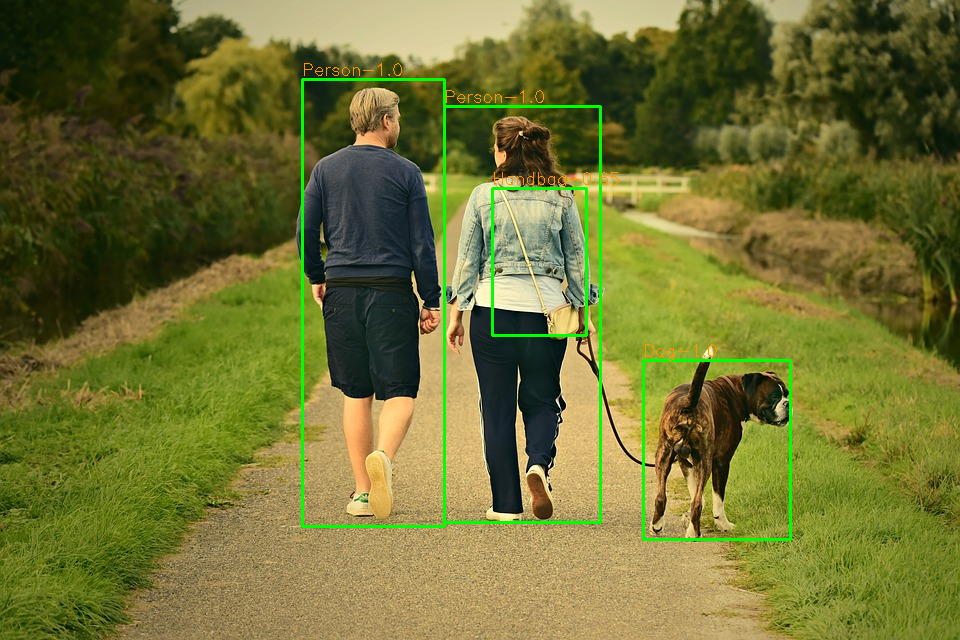

# Use API Object Detection of MMLAB - UIT.



## The flow working is:
1. Login in to Mmlab and get token
2. Use thtoken to using API: the sending data is the encoded image object and the response is the file json that containt all bounding boxes, class name, scores of objects in images.
3. Use the json file to draw rectangles in image and display to screen.

## Structure of source code
```
Use MMLAB's API/
├── detect_objects.py
├── input
│   ├── test1.png
│   ├── test2.png
│   ├── test3.png
│   └── test.png
├── output
│   ├── detected_test2.png
│   ├── detected_test3.png
│   └── detected_test.png
└── user_login.py
```

## Run the application by following command in terminal/command line:

```
python3 detect_objects.py
```

that will use the input image is *test.png*.

If you want to use your image, just move it to the directory `input/` and run the following command:

```
python3 detect_objects.py -path name_image
```
